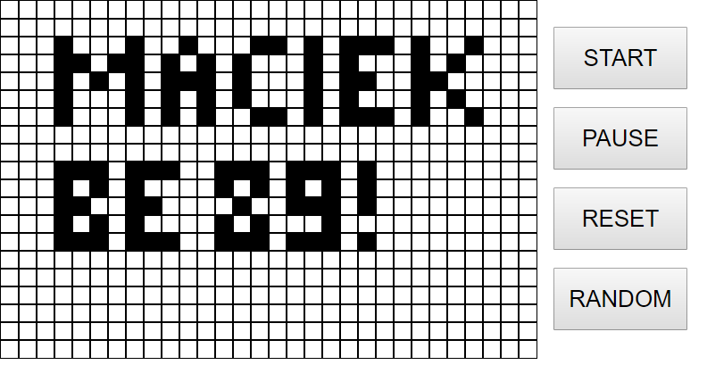

### Game of life by [@Maciekbe89](http://github.com/Maciekbe89)!
---

### Hello

It is my another game - I created that in vanilla javascript. The game of life is a cellular automaton devised by John Horton Conway :earth_africa:

### design:

Apart from standard version we can choose initial board by selecting cells :dart:

